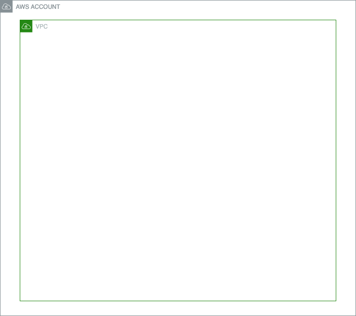
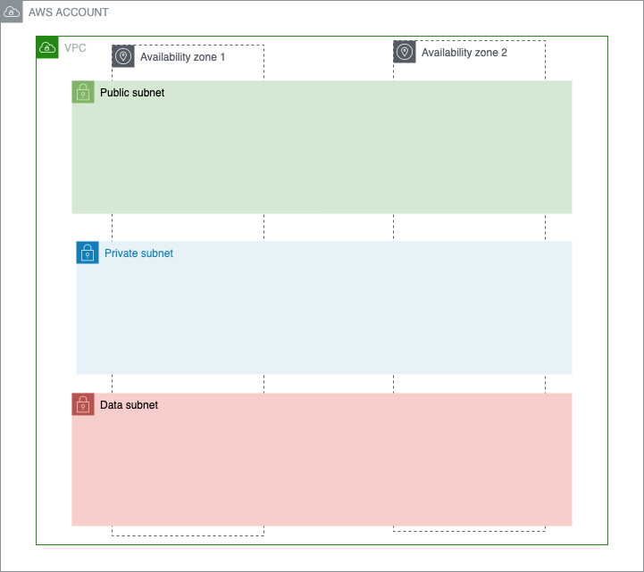
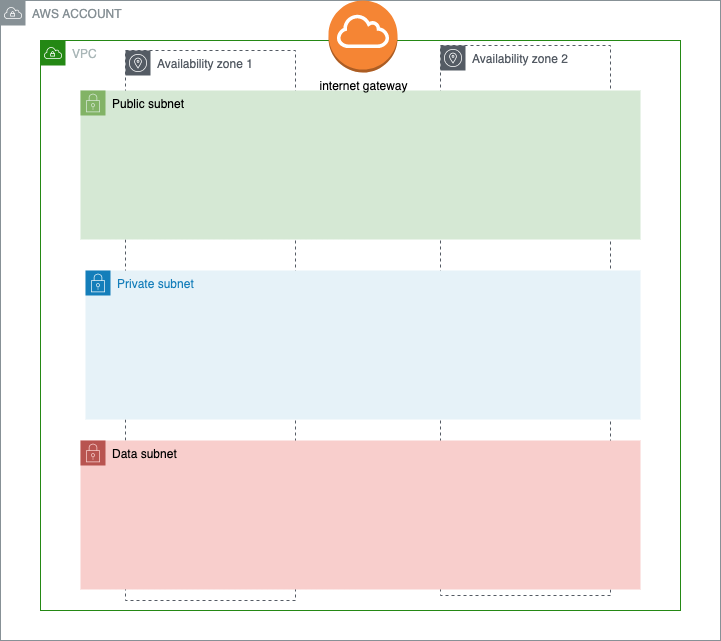
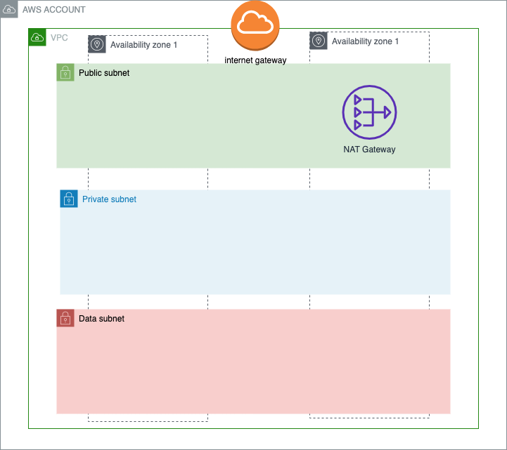
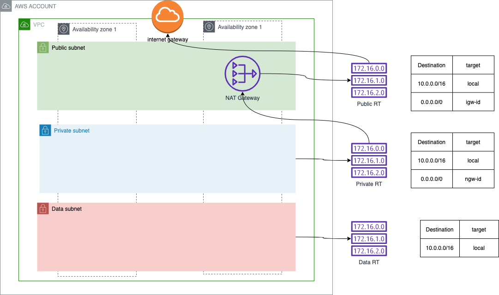

# Module 1 : Networking

## Overview

## Lab

## Create VPC

* Go to AWS VPC service
* Go to VPC tab
* Create a new VPC:
  * Name = name of the VPC (ex: my-vpc)
  * IPv4 CIDR Block = 10.0.0.0/16
  * Tags : respect tagging policy

## Create Subnets

We will create here 6 subnets:
* 2 public
* 2 private
* 2 data

For CIDR blocks, you'll have to create 6 block of /25 IPs.
You can find a CIDR block calculator : https://cidr.xyz/

example of value: 10.0.1.0/25

**REMINDER: NO IP OVERLAPPING IS ALLOWED**

* Go to VPC service
* Go to subnets tab
* Create new subnet
* Select the good VPC previously created

You can create all subnets at once, with the "Add new subnet" bouton.

### Public subnets
Repeat twice:

* subnet name: name of the public subnet (ex: my-subnet-public-1 / my-subnet-public-2)
* choose a random AZ (**MUST BE DIFFERENT FOR EACH SUBNET OF A KIND**)
* IPv4 CIDR block: fill in
* add mandatory tags

### Private subnets
Repeat twice:

* subnet name: name of the public subnet (ex: my-subnet-private-1 / my-subnet-private-2)
* choose a random AZ (**MUST BE DIFFERENT FOR EACH SUBNET OF A KIND**)
* IPv4 CIDR block: fill in
* add mandatory tags

### Data subnets
Repeat twice:

* subnet name: name of the public subnet (ex: my-subnet-data-1 / my-subnet-data-2)
* choose a random AZ (**MUST BE DIFFERENT FOR EACH SUBNET OF A KIND**)
* IPv4 CIDR block: fill in
* add mandatory tags

Now we have a fonctionnal private network zone. We will focus now on internet connectivity and separating the different subnets. 

## Create internet gateway

* Go to VPC service
* Go to internet gateway tab
* Create internet gateway
  * name: internet gateway name (ex: my-igw)
  * add mandatory tags

* Select your new IGW
* click "Actions" / Attach
  * Select your VPC
  * Attach

Now you have internet connectivity for your VPC, all managed by AWS.

## Create NAT gateway

* Go to VPC service
* Go to NAT gateways tab
* Create NAT gateway 
  * name: NAT gateway name (ex: my-ngw)
  * select a **public subnet** from your VPC
  * click "allocate elastic ip"
  * add mandatory tags

## Route tables

Now that we have connectivity set, we have to customize our route table in manner to create our 3 different zones:

* public : Directly connected to internet and can be exposed
* private : Can reach internet but cannot be exposed
* data : no internet connectivity at all

### Public route table
#### Create route table
* Go to VPC service
* Go to route table table
* Create route table
  * Name: name of the route table (ex: my-public-rt)
  * Select your VPC
  * Create route table

#### Associate route table to subnets
* Open your new route table
* Go to "Subnet associations"
* Click "Edit subnet associations"
* Select your two public subnets
* Save

#### Update the routes
* Open your new route table
* Go to "routes"
* Click "Edit routes"
* Add a route
  * Destination : 0.0.0.0/0 (everything)
  * Target : 
    * Internet Gateway
    * Select your Internet Gateway

### Private route table
#### Create route table
* Go to VPC service
* Go to route table table
* Create route table
  * Name: name of the route table (ex: my-private-rt)
  * Select your VPC
  * Create route table

#### Associate route table to subnets
* Open your new route table
* Go to "Subnet associations"
* Click "Edit subnet associations"
* Select your two private subnets
* Save

#### Update the routes
* Open your new route table
* Go to "routes"
* Click "Edit routes"
* Add a route
  * Destination : 0.0.0.0/0 (everything)
  * Target : 
    * NAT Gateway
    * Select your NAT Gateway

### Data route table
#### Create route table
* Go to VPC service
* Go to route table table
* Create route table
  * Name: name of the route table (ex: my-data-rt)
  * Select your VPC
  * Create route table

#### Associate route table to subnets
* Open your new route table
* Go to "Subnet associations"
* Click "Edit subnet associations"
* Select your two data subnets
* Save

## Conclusion
We have now a fully operationnal VPC, with distinct subnets that we will use in the next module.

## Bonus

Let's look at AWS Cloudformation, and the benefits of IaC.
Cloudformation is a native AWS tool for doing IaC.

Have a look at the cloudformation template: `./files/vpc-multi-tier.yml`

It can create all the previous resource as code, in once.

### Create a cloudformation stack for VPC

* Go to AWS Cloudformation service
* Create stack with new ressources
* Select "template is ready"
* Select upload a file
* choose the `vpc-multi-tier.yml` file
* enter a stack name
* leave all default value for parameters (feel free to have a look for each parameter on the template)
* Click next
* put mandatory tags
* Click next
* Click create stack

Have a look on all the stack tabs while creating.
At the end, look at the Resources tab to see what has been created.

Go to AWS VPC service and have a look to the VPC created and all the rest. 

**DELETE STACK WHEN DONE**

* Select your stack
* Click on Delete
* Confirm
