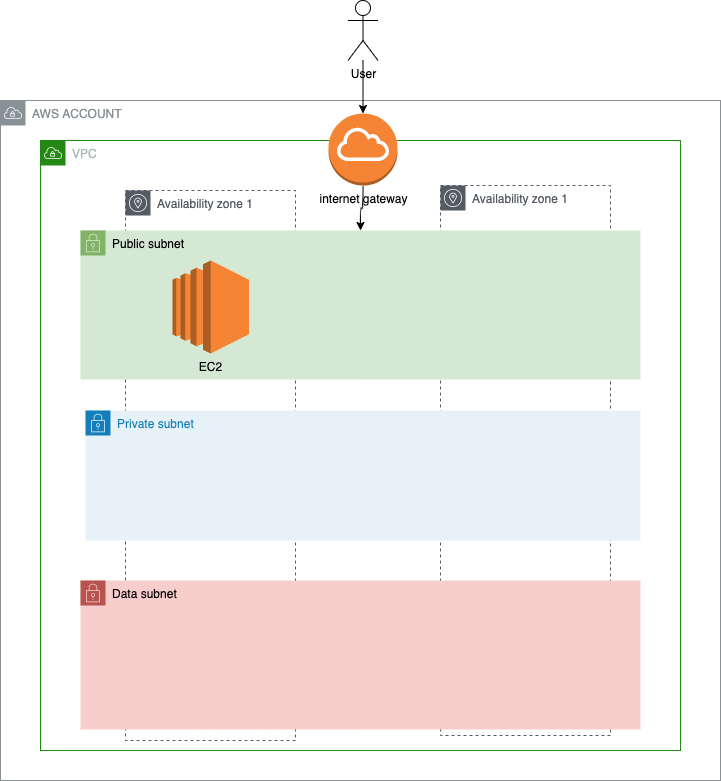

# Module 2 : Computing part 1

## Overview



## Lab

## First EC2
### Create a key pair

* Go to AWS EC2 service
* Go to key pair tab
* Create a key pair:
  * Name: name of the key pair (ex: my-kp)
  * type: RSA
  * format: .pem
  * add mandatory tags
* Create key pair

**Save the file**: 

This is a very important step, as if you loose your key, you won't be able to retrieve it.

* Go to instances tab
* Click launch instance
  * Name: name of the server (ex: my-ec2)
  * AMI: leave default : Amazon Linux 2
  * Instance type:  t2.micro
  * Key pair: the key pair name created
  * Network settings:
    * click edit
    * select your VPC
    * select a public subnet
    * auto-assign public IP : enable
    * select existing security group
      * choose default
* Launch instance


You have now a public EC2 server.
We will try to connect with ssh on it.

Find the public IP address of your server. (ex: 18.156.35.186)
By default, ssh-user is : `ec2-user`

```sh
# ssh -i <path_to_key> <ssh_user>@<public_ip>

ssh -i ~/cle/my-kp.pem ec2-user@18.156.35.186
```

Something went wrong ? a timeout perhaps ?
It's normal, we did not authorise your IP to connect to the instance.
Let's do it.

### Create and apply a security group

* Go to AWS EC2 service
* Go to security group tab
* Create security group
  * Name: the name of the security group (ex: my-sg)
  * Description: allow my ssh
  * Choose your VPC
  * Add inbound rule
    * Type: SSH
    * Source: My Ip
    * Description: a description
  * add mandatory tags
* Create SG

* Go to instances tab
* select your instance
* click Actions
  * Networking
    * Change security Groups
    * Select your SG

Let's try again the ssh:
```sh
# ssh -i <path_to_key> <ssh_user>@<public_ip>

ssh -i ~/cle/my-kp.pem ec2-user@18.156.35.186
```

you should now be able to connect with SSH to your server.

### Install apache

```sh
# become root
sudo su -

# Yum update
yum update -y

# install necessary
yum install default-jre httpd python-simplejson -y

# Start apache
service httpd start

# enable apache
systemctl enable httpd

# test your apache
curl localhost

# Customise your website
echo '<html><body> Hello World </body></html>' > /var/www/html/index.html 

# test your website
curl localhost
```

If you know HTML, feel free to have fun with your website.

### Test your website

Now your website is running on port 80 and is publicly exposed.

Try to navigate to your website: 
http://<my_ip>

Something went wrong ? a timeout perhaps ?
It's normal, we did not authorise your IP to browse your website on port 80.
Let's do it.

### Update security group

We will know allow port 80 from your IP on the server.

* Go to AWS EC2 service
* Open security group tab
* select your security group
* Edit inbound rules
  * Add rule
    * Type: HTTP
    * Source: My IP
  * Save

Go back to your website.
It works !

### install and configure wordpress

First, install php:

* Go back to the server (still in root)

```sh

# enable php 7 
amazon-linux-extras enable php7.4

# yum clean metadata
yum clean metadata

# install php 
yum install php-cli php-pdo php-fpm php-json php-mysqlnd php-gd -y

# check php version
php -v

# restart apache
service httpd restart

# Create a php info page
echo '<?php phpinfo() ?>' > /var/www/html/info.php

# test your new page
curl localhost/info.php
```

Test from your browser : http://<my_public_ip>/info.php


If you are familiar with php, do not hesitate to customize more your php website.

Then, install a local database:
* Go back to the server (still in root)

```sh
#install mysql server 
sudo yum install -y mariadb-server 

#start the mysql server 
sudo systemctl start mariadb 

#enable mysql to start when system reboots 
sudo systemctl enable mariadb 

#Secure the database
sudo mysql_secure_installation
```

Enter current password for root: Press return for none
Change Root Password: Y
New Password: Enter your new password
Remove anonymous user: Y
Disallow root login remotely: Y
Remove test database and access to it: Y
Reload privilege tables now: Y

Finally, install & configure wordpress:
* Go back to the server (still in root)
```sh
# Go to apache dir
cd /var/www/html

# download wordpress latest release
wget http://wordpress.org/latest.tar.gz

#untar it
tar -xzvf latest.tar.gz

#create blog
mv wordpress blog

# Create wordpress config
cd blog
mv wp-config-sample.php wp-config.php
vi wp-config.php

# Override those parameters
DB_NAME='blog'
DB_USER='root'
DB_PASSWORD='changeme'
DB_HOST='localhost'

# Create blog database on local mysql
mysql -p

# enter root password set earlier
CREATE DATABASE blog;
GRANT ALL PRIVILEGES ON blog.* TO "root"@"localhost";

# exit mysql
```

Go test your wordpress: http://<my_pulic_ip>/blog

Setup your wordpress, and share a post !


### Create an AMI

Let's now create an AMI from this EC2 server, to capture it's state and reuse it after.
Doing this, we won't have to reinstall and reconfigure our website.

* Go to AWS EC2 service
* Go to instance tab
* Select your EC2
* click actions
  * Image
    * Create Image
      * image name: the AMI name (ex: my-ami)
      * image description: a description

### Test your AMI
Let's go check the status of your AMI:
* Go to AWS EC2 service
* Go to AMIs tab
* Find you AMI and wait for it to be ready
* Click actions
  * Launch
  * Use same parameters as the first AMI (t2.micro, public, etc ..)
  * Launch

go to the website : http://<new_public_ip>

### Delete all public servers

* Go to AWS EC2 service
* Select all your servers created here
* Click instance state
* terminate
