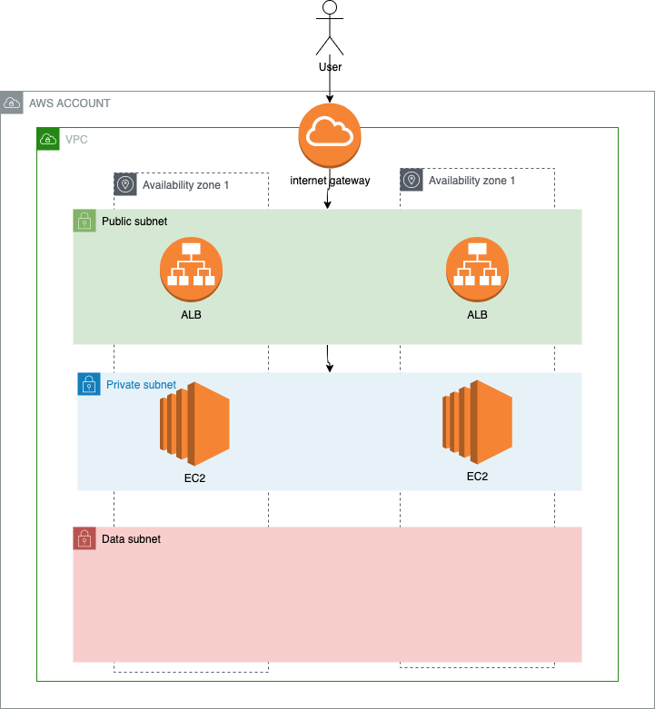
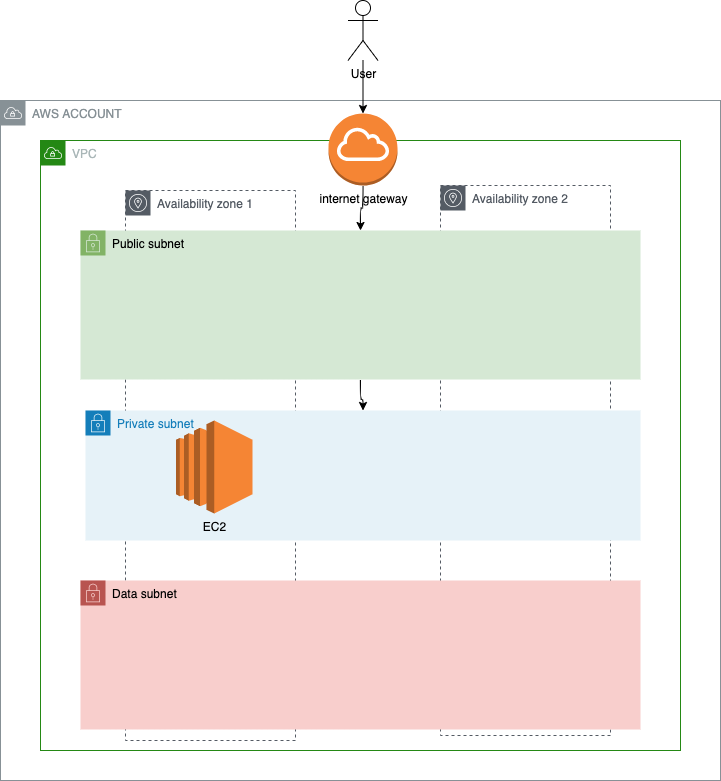
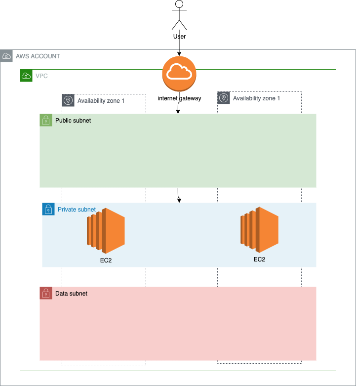

# Module 3 : Computing part 2

## Overview



## Lab

## Create a private EC2 instance

In this part, we will create one EC2 inside the private subnets.



* Go to AWS EC2 service
* Go to AMI tab
* retrieve the AMI created in module_02
* select it
* Click launch instance from AMI
  * Name: name of the server (ex: my-ec2)
  * AMI: leave default  your custom AMI
  * Instance type:  t2.micro
  * Key pair: the key pair name created
  * Network settings:
    * click edit
    * select your VPC
    * select a private subnet
    * auto-assign public IP : disable
    * select existing security group
      * choose previously created
* Launch instance

If you have a good understanding on the network in place, you'll understand that you will not be able to connect directly to the server, because it's in the private subnet.

Let's give a try to confirm ( ssh or http ).
No worries, AWS has a workaround for us.

## Create and assign IAM instance profile

In this part, we will create an IAM instance profile.
The instance proile can be assign to an EC2, giving it rights on AWS APIs, without storing any credentials on the server.

Create role: 
* Go to AWS IAM service
* Go to role tab
* Create role
  * Trusted Entity type: AWS Service
  * Use Case: EC2
  * Next
  * Search for policy : AmazonSSMManagedInstanceCore
  * Select it
  * Next
  * Role Name: the IAM role name (ex: my-instance-profile)
  * Add mandatory tags
  * Create role

Assign role:
* Go to AWS EC2 service
* Go to instance tab
* Select your server
* Click actions
  * Security
    * Modify IAM role
      * select role you created
* click instance state
  * reboot

## Use AWS SSM to connect on the server

AWS SSM is an AWS service that has a lot of usage. 
One of them is administration of EC2 server, and for example connection ssh on it throught the browser.

* Go to AWS EC2 service
* Go to instance tab
* Select your server
* click connect
* chose "Session Manager" tab
* click connect

We can now connect on the server without using SSH and being exposed online.
AWS handles the security for us, and we use IAM to allow or not people to connect with AWS SSM on servers. 

## Deploy another wordpress


We will now deploy another wordpress, in a second AZ.
This is to have some High Availabilty (HA) on our website.

* Go to AWS EC2 service
* Go to instance tab
* Select your server
* click actions
  * image and templates
  * Launch more like this
    * key pair: proceed without one ( we have SSM now ! )
    * subnet: choose another private subnet

We will now change the index of the html page only for the second server.

Use SSM to connect to the new server

```sh
# become root 
sudo su - 

# change index.html 
echo '<html><body> 42 </body></html>' > /var/www/html/index.html

# test changes
curl localhost
```

## Deploy an Aplication Load Balancer (ALB)

### Create a dedicated SG

* Go to AWS EC2 service
* Go to security group tab
* Create security group
  * Name: the name of the security group (ex: my-sg-for-alb)
  * Description: allow http
  * Choose your VPC
  * Add inbound rule
    * Type: HTTP
    * Source: My Ip
    * Description: a description
  * add mandatory tags
* Create SG

### Create a target group

* Go to AWS EC2 service
* Go to target group tab
* create target group
  * type: instances
  * name: the target group name (ex: my-tg)
  * protocol: http
  * port: 80
  * VPC : choose your vpc
  * Protocol version: http1
  * next
  * select your two instances
  * click include as pending
  * create target group

### Create the ALB

We will deploy an ALB, which will be internet facing.
ALBs are fully managed by AWS.


* Go to AWS EC2 service
* Go to load balancer tab
* Create load balancer
  * Select application load balancer
  * basic conf
    * Name: the name of the ALB (ex: my-alb)
    * Scheme: internet facing
  * Network
    * IP adresse type: IPv4
    * VPC: select your vpc
    * select all AZ with public subnets
  * Security groups
    * select the load balancer security group
  * Listeners and routing
    * protocol: HTTP
    * port: 80
    * target group : the one previously created
* Create load balancer


Once load balancer is provisionned, find its DNS name.
You see that AWS provides a generical DNS that is public, and hosted by AWS.

example: my-alb-1191625645.eu-central-1.elb.amazonaws.com

Try to go to it's url. 
Not working ?
Again, it's a security group issue.

Indeed, the security group on the EC2 is not allowing any traffic coming from the load balancer.

Let's change that.

### update EC2 SG
* Go to AWS EC2 service
* Open security group tab
* select your security group for EC2
* Edit inbound rules
  * You can delete the present rules, as we don't connect directly in ssh of http
  * Add rule
    * Type: HTTP
    * Source: ALB SG id
      
As you can see here, we can create SG rules, with the source being the ID of another security group.
This is awsome feature for us.

### test your website

Go to the root page : 
http://<my_alb_dns>

try to refresh it several times (or use curl, it's faster)

You'll see that we load balance well on both servers.

You can now have issues on the blog (/blog)
See next module to fix it.
