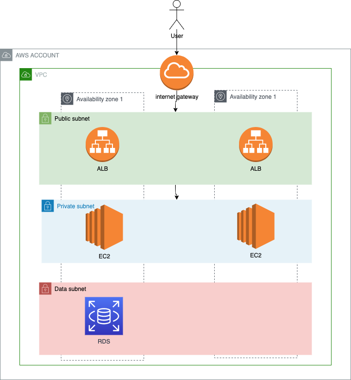

# Module 4 : Database

## Overview


We will now look into AWS managed databse with AWS RDS.
The goal is to mutualise the databse, as each server has a local database, so duplicate and non synchronized data.

## Lab


## Create RDS SG

We first need to create the SG that will be associated to the RDS database.

Inputs: 
* The SG needs to authorise port 3306 incoming from the EC2
* The source of a rule can be another SG (use the SG id)

<details>
<summary>SOLUTION</summary>

* Go to AWS EC2 service
* Go to security group tab
* Create security group
  * Name: the name of the security group (ex: my-sg-for-rds)
  * Description: allow sql
  * Choose your VPC
  * Add inbound rule
    * Type: Custom TCP
    * port : 3306
    * Source: the SG EC2 ID
    * Description: a description
  * add mandatory tags
* Create SG

</details>

## Create RDS subnet group

Now, we will create a RDS subnet group.
RDS needs this ressource to be created, to have network information.

The goal is to create this RDS subnet group, including only data subnets.

<details>
<summary>SOLUTION</summary>

* Go to AWS RDS service
* Go to subnet groups tab
* Create subnet group
  * Name: the name of the subnet group (ex: my-subnet-group)
  * Description: a description
  * VPC : choose your VPC
  * Choose all AZ
  * Pick all data subnets 

</details>

## Create RDS mysql database

Now we can create the RDS database.

Inputs:
* Engine: Maria DB
* version: latest
* template: dev
* Instance configuration:
  * class: burstable
  * type: db.t3.micro
* use yhe good SG
* use the good subnet group

<details>
<summary>SOLUTION</summary>

* Go to AWS RDS service
* Go to databse tab
* Create database
  * Engin Options
    * type: Maria DB
    * Version: latest
  * template: 
    * dev/test
  * Settings:
    * identifier: an identifier for your RDS (ex: my-db)
    * credentials:
      * admin
      * changeme
  * Instance configuration:
    * class: burstable
    * type: db.t3.micro
  * Storage: leave default
  * Availability: leave default
  * Connectivity
    * Do not connect to EC2 compute ressource
    * Network type: IPv4
    * VPC: choose your VPC
    * Choose previously created subnet group
    * No public access
* Create database

</details>

**Please check all settings, and the estimation of monthly cost ( should not be more that 20$ / month )**

Wait for the databse to up and ready.
Once done, you can find out what the databse DNS is.

example: my-rds.cffndfb0mxg7.eu-central-1.rds.amazonaws.com

## Connect the servers to RDS 

Now, we will go back on our servers and configure the php wordpress to use our new database.

Connect to both server with AWS SSM:

```sh
# become root
sudo su -

# change username
sed 's#root#admin#g' /var/www/html/blog/wp-config.php -i

# change db host
sed 's#localhost#<MY_RDS_DNS>#g' /var/www/html/blog/wp-config.php -i

#change password
# BE CAREFUL, IF PASSWORD A COMMON WORD, GO CHANGE BY HAND OR YOU WILL CORRUPT FILE
sed 's#<OLD_PASSWORD>#<NEW_PASSWORD>#g' /var/www/html/blog/wp-config.php -i

## DO THIS SECTION ONLY ONCE
# connect to RDS database
mysql <MY_RDS_DNS> -h  --user admin -p

# create blog database and grant to admin
CREATE DATABASE blog;
GRANT ALL PRIVILEGES ON blog.* TO "admin";

```

Go see your blog !
You'll have to repost because we didn't migrate de the data.

If you want to try, do not hesitate.
