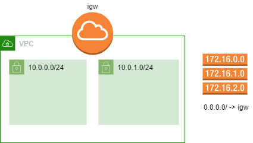
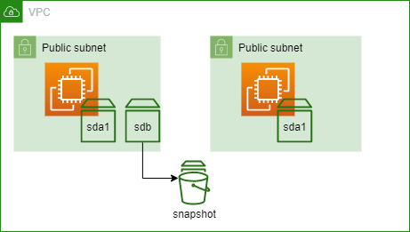

# Module 7 : Storage

## Prerequisites

Create 2 new private subnets in your existing VPC. 



## 1. Lab EBS


### 1.1. Create 2 Instances with an extra volume

The first step is to create 2 new instances. We have several requirements for these servers : 
  * The 2 instances must be your 2 subnets 
  * We need the root volume to be a GP3 SSD volume (default IOPS and Throughput)
  * **One** of the 2 instances must have a ST1 HDD of the minimal size possible. 
  * You will connect via SSM.  


<details>
<summary>SOLUTION</summary>

* Go to AWS EC2 service
* Go to Instances and click Launch Instances
  * Define a name for your instance, such as my-instance-01
  * Select the **Amazon Linux** AMI.
  * Instance type : t2.micro
  * Key pair: Proceed without keypair
  * Network settings:
    * Click on edit
    * select your VPC
    * select a private subnet
    * auto-assign public IP : disable
    * select existing security group
      * choose the default one
  * Storage Settings:
    * Click on **Advanced**
    * Change the volume type for GP3 on the Volume 1
    * **For only 1 instance**:
      * Click on add volume
      * In this new volume, change the volume type to ST1 and the size to 125
  * Open Advanced Details
    * Select the IAM instance profile for SSM. 
  * Launch instance and repeat for the 2nd instance. 
</details>

### 1.2. Snapshot your volume

You have an instance with 2 volumes : on root volume (SSD) and one data volume (HDD). 
Create a XFS (EXT4, or other) partition of the data volume (use command *mkfs.xfs*)
Mount the data volume in the instance system on **/data** and write an empty file in it. 
Then save this volume by creating a **snapshot** of it. 



<details>
<summary>SOLUTION</summary>

* Select your instance
* Click on Connect 
* Use the **Session Manager** tab and click on Connect
* Execute the following commands :
```sh
### Become root
sudo -i

### Identify your volume
lsblk

### Create your local mount point
mkdir -p /data

### Create partition on the volume 
mkfs.xfs /dev/xvdb

### Mount the volume
mount /dev/xvdb /data

### Create a test file in the folume
echo "test" > /data/test_file.txt

```
* Come bak to AWS console, navigate to Instances, select your instance and click on the **Volume id** under the **Storage** Tab
* Select the volume and under Action select **Create snapshot**
* Give it a description and then Create snapshot
* You can watch its creation with the Snapshot menu
</details>

### 1.3. Restore your snapshot

Now that you have saved data with a Snapshot, restore it in your 2nd instance but as a **SSD (GP3), not HDD**. 
Optional : Encrypt this volume with a default KMS Key. 


<details>
<summary>SOLUTION</summary>

* Go to the Snapshots menu, select your Snapshot and in Action, select Create volume from snapshot
* Select GP3 and volume type
* Select the same Availability Zone as your instance
* Optional : 
  * Select Encrypt this volume
  * Select the default aws/ebs key
* Create volume
* Navigate to the Volumes menu
* Select your newly create volume and under Action, select Attach volume
* Select the 2nd instance
* Name the device /dev/sdb
* Navigate to the Instances menu and select your 2nd instance
* Click on Connect 
* Use the **Session Manager** tab and click on Connect
* Execute the following commands :
```sh
### Become root
sudo -i

### Identify your volume
lsblk

### Create your local mount point
mkdir -p /data

### Mount the volume
mount /dev/xvdb /data

### See content of the test file
cat /data/test_file.txt

```
</details>

### 1.4. Conclusion

Notice the following with EBS : 
* EBS is a logical volume you attach to an instance. Just like a drive you plug to a server 
* You can switch from a type to an other without migrating your data
* Your instances are UP and running when you played with the EBS : no interruption of service
* You can reencrypt data from a snapshot easily.  
