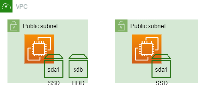
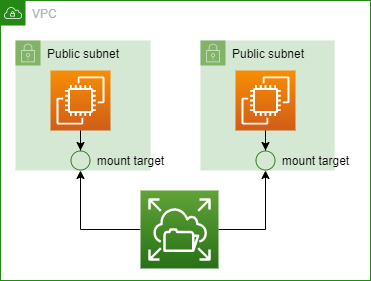

# Module 7 : Storage

## Prerequisites

Create 2 new private subnets in your existing VPC. 


## 1. Lab EBS


### 1.1. Create 2 Instances with an extra volume

The first step is to create 2 new instances. We have several requirements for these servers : 
  * The 2 instances must be your 2 subnets 
  * We need the root volume to be a GP3 SSD volume (default IOPS and Throughput)
  * **One** of the 2 instances must have a ST1 HDD of the minimal size possible. 
  * You will connect via SSM.  



<details>
<summary>SOLUTION</summary>

* Go to AWS EC2 service
* Go to Instances and click Launch Instances
  * Define a name for your instance, such as my-instance-01
  * Select the **Amazon Linux** AMI.
  * Instance type : t2.micro
  * Key pair: Proceed without keypair
  * Network settings:
    * Click on edit
    * select your VPC
    * select a private subnet
    * auto-assign public IP : disable
    * select existing security group
      * choose the default one
  * Storage Settings:
    * Click on **Advanced**
    * Change the volume type for GP3 on the Volume 1
    * **For only 1 instance**:
      * Click on add volume
      * In this new volume, change the volume type to ST1 and the size to 125
  * Open Advanced Details
    * Select the IAM instance profile for SSM. 
  * Launch instance and repeat for the 2nd instance. 
</details>

### 1.2. Snapshot your volume

You have an instance with 2 volumes : on root volume (SSD) and one data volume (HDD). 
Create a XFS (EXT4, or other) partition of the data volume (use command *mkfs.xfs*)
Mount the data volume in the instance system on **/data** and write an empty file in it. 
Then save this volume by creating a **snapshot** of it. 


<details>
<summary>SOLUTION</summary>

* Select your instance
* Click on Connect 
* Use the **Session Manager** tab and click on Connect
* Execute the following commands :
```sh
### Become root
sudo -i

### Identify your volume
lsblk

### Create your local mount point
mkdir -p /data

### Create partition on the volume 
mkfs.xfs /dev/xvdb

### Mount the volume
mount /dev/xvdb /data

### Create a test file in the folume
echo "test" > /data/test_file.txt

```
* Come bak to AWS console, navigate to Instances, select your instance and click on the **Volume id** under the **Storage** Tab
* Select the volume and under Action select **Create snapshot**
* Give it a description and then Create snapshot
* You can watch its creation with the Snapshot menu
</details>

### 1.3. Restore your snapshot

Now that you have saved data with a Snapshot, restore it in your 2nd instance but as a **SSD (GP3), not HDD**. 
Optional : Encrypt this volume with a default KMS Key. 


<details>
<summary>SOLUTION</summary>

* Go to the Snapshots menu, select your Snapshot and in Action, select Create volume from snapshot
* Select GP3 and volume type
* Select the same Availability Zone as your instance
* Optional : 
  * Select Encrypt this volume
  * Select the default aws/ebs key
* Create volume
* Navigate to the Volumes menu
* Select your newly create volume and under Action, select Attach volume
* Select the 2nd instance
* Name the device /dev/sdb
* Navigate to the Instances menu and select your 2nd instance
* Click on Connect 
* Use the **Session Manager** tab and click on Connect
* Execute the following commands :
```sh
### Become root
sudo -i

### Identify your volume
lsblk

### Create your local mount point
mkdir -p /data

### Mount the volume
mount /dev/xvdb /data

### See content of the test file
cat /data/test_file.txt

```
</details>

### 1.4. Conclusion

Notice the following with EBS : 
* EBS is a logical volume you attach to an instance. Just like a drive you plug to a server 
* You can switch from a type to an other without migrating your data
* Your instances are UP and running when you played with the EBS : no interruption of service
* You can reencrypt data from a snapshot easily.  

## 2. Lab EFS

You have seen you can use EBS to store data. Now you need a share space to deposit files, with EFS.



### 2.1. Create a SG for NFS

Create a Security Group that allows **NFS inbound** flow in your VPC.

<details>
<summary>SOLUTION</summary>

* Go to the AWS EC2 service
* Select the Security Groups menu and create a new Security group: 
  * Name it efs-inbound, same for the description
  * Select your VPC
  * Add a inbound rule for the NFS protocol and the 10.0.0.0/8 CIDR range 
  * Create the Security Group

</details>


### 2.2. Create a new EFS

Create an standard EFS.

<details>
<summary>SOLUTION</summary>

* Go to the AWS EFS service
* Click on **Create file system**
* Chose a name such as my-efs
* Select your VPC
* Create
* When the file system is created click on it and **View details**
* Go under **Network** tab and click on Manage
* For each mount target, select the Security group you created and save


</details>

### 2.3. Mount the EFS

You have created a new EFS, now you need to mount it on both instances. The local folder might be /efs.

<details>
<summary>SOLUTION</summary>

* Go to the AWS EFS service
* Click on your EFS and **View details**
* Click on **Attach**
* Copy the second command : 
  * `sudo mount -t nfs4 -o nfsvers=4.1,rsize=1048576,wsize=1048576,hard,timeo=600,retrans=2,noresvport <fsname>:/ efs`
* In the AWS EC2 Service, go under Instances menu
* Click on your first instance and Connect
* Chose the Session Manager Tab and Connect
* Execute the following commands:
```sh 
# Become root
sudo -i

# Create local folder
mkdir -p /efs

# Mount the EFS. Notice we have changed the mount point given by aws (efs -> /efs)
sudo mount -t nfs4 -o nfsvers=4.1,rsize=1048576,wsize=1048576,hard,timeo=600,retrans=2,noresvport <fsname>:/ /efs
```
<details>
<summary>Go Further</summary>
When you try to resolve the DNS name of your FS, it wont be the same IP returned on one instance or the other. 
It will return the IP of the EFS mount target of the instance Availability zone. You can check it in the detail of the EFS.
</details>
* Repeat for the 2nd instance
* If you write data in /efs for one the 2 instances, the other should also see the modifications

</details>

### 2.5. (Optional) Question

Can you guess the EFS size ? 

### 2.4. Conclusion

EFS is useful when you need to share data in realtime with other servers such as cache, frontend server files, documents etc. 
It uses NFS and consequently doesn't match high performance use cases (i.e do not host an Oracle database on EFS)
Windows doesn't support natively NFS so it is mainly used by Unix systems. 

You never specified the size of the EFS, meaning you can add as much data as you want and you will pay for it at the GB, in opposite of the EBS where you reserved an amount of GB and pay for it even if your EBS isn't full. It also means the EFS **can cost A LOST** (do not log applications on it if you don't have a proper log cleaner policy)

## 3. Lab S3 Bucket

### 3.1. Create a S3 Bucket

Create a S3 bucket, name it with your name as prefix, for example : *myname-my-bucket-example*
Activate the versioning and encrypt it with the S3 Key. 

<details>
<summary>SOLUTION</summary>

* Go AWS S3 Service
* **Create Bucket**:
  * Name it as wanted
  * Disable the ACL
  * Block the Public Access
  * Enable versioning
  * Enable server-side encrypt with the S3 managed keys.
  * Create Bucket

</details>

### 3.2. Upload to S3 and check versions

Create a file on your desktop and upload it multiple times. Modify your file between each upload. Check the different versions and restore one of them as current. 

* Create a text file on your laptop. 
* Click on your bucket
* Click on Upload and Add files. Select your text file. Upload
* Repeat the operation as many times you want and modify your file (by incrementing an integer for example)
* Go to your Bucket, under Objects. 
* Click on your text file. You have the detail of your object here : size, URI, etc. 
* Go under Versions:
  * Download the version of your choice. You retrieve the version you uploaded earlier. 
  * Select the *current version* of Delete it.
  * Go back to the version tab and check the current version of your object.

### 3.3. Discover Object class

We will now simulate the fact that your file is an archive. For legal reason you need to store it for 3 years but you don't need to access it oftenly. 

Upload a new file in your bucket with the storage class **Glacier Flexible Retrieval**. 
Then, try to download the file from S3.

<details>
<summary>SOLUTION</summary>

* Click on your bucket
* Click on Upload and Add files. Select your file
* Under properties, select the Glacier Flexible Retrieval class, and upload 
* Now your file is uploaded but is not available for read 
* Select the object, and **initiate restore** under Actions:
  * Set the number of days at 1
  * Select **Expedited retrieval** 
  * Initiate Restore
* Wait a couple of minute (max 5min)
* Select the object again, you should be able to Download it

</details>

### 3.4. Create lifecycle rule 

Glacier is a very cost effective storage class (3.6$/TB/month) but is doesn't allow to get your data instantly. Also, the retreival is more expensive than the standard class: it is designed for archive and cold storage. 
A good solution is to implement a lifecycle rule, to automatically migrate old objects or versions from a class to an other. 

Disable versioning on the bucket and create a lifecyle rule that has the following characteristics: 
* Migrate objects from standard to Glacier Instant Retrieval after one week. 
* Migrate objects from Glacier Instant Retrieval to Glacier Deep Archive after 120 days
* Delete objects olders than 365 days
* Delete incomplete multipart upload after one week

It will be applied to every objects of the bucket

<details>
<summary>SOLUTION</summary>

* Click on your bucket
* Go under Management, **create lifecycle rule**:
  * Name: my-lifecyle-rule
  * Rule scope: Apply to all
  * Rule actions, select the following options: 
    * *Move current versions of object between storage classes*
    * *Expire current versions of objects*
    * *Delete expired objects markers or incomplete multipart upload*
  * Transition current versions option: 
    * Select Glacier Instant Retrieval and set the value to 7 days
    * Add a transition
    * Select Glacier Deep Archive and set the value to 120 days
  * Expire current version option:
    * Set the value to 365
  * Delete incomplete multipart uploads option: 
    * Set the value to 7
  * Create rule

</details>
