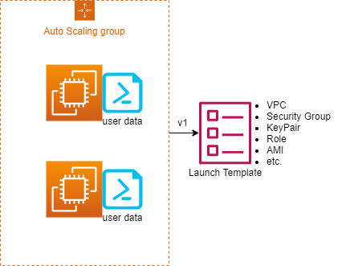
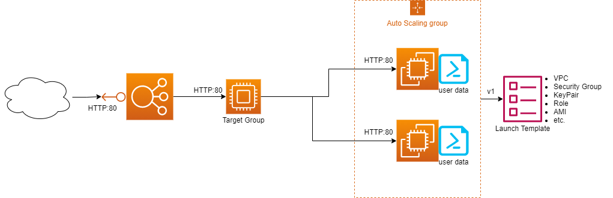
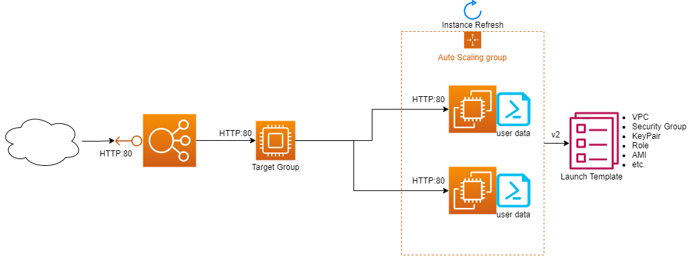
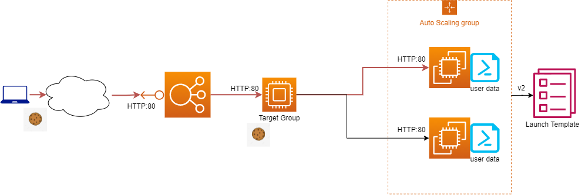

# Module 9 : Database & HA

## Prerequisites

You need a VPC with subnet configured 

## 1. Lab DynamoDB


### 1.1. Create the DynamoDB

We will use Cloudformation to deploy the DynamoDB. 
Use the acg-dynamodb-template.yaml file to create it. 
Review the created DynamoDB. 


<details>
<summary>TIPS</summary>

* Download the file from git (Raw then save-as in YAML)
* Verify the cloudformation yaml
* Create a stack in Cloudformation Service 
  * Use **upload a template file**
  * Use a custom Stack Name such as **DynamoDBTest**
  * Leave everything else as-is
* Review the DynamoDB table in AWS DynamoDB Service
</details>

### 1.2. Add items in the table

Add the following items in the table:
  1. CustomerName: Nicolas
     1. ProductBought: Laptop
     2. ProductBoughtAmount: 2
  2. CustomerName: Angelique
     1. ProductSold: Mouse
     2. ProductSoldAmount: 10

Check the DynamoDB table overview : items summary, metrics etc.

<details>
<summary>TIPS</summary>

* Before creating an item you need to **explore table items**
* When creating an item you can add extra parameters, only the Partition key and Sort key are mandatory (if a sort key is defined at the table creation)
* To view the Table detail go back to **View table details**
</details>

## 2. Autoscaling Groups

### 2.1. Launch Configuration


Create Launch template (not a Launch configuration) with the following parameters :
* Any name you want
* The AMI is Amazon Linux last version
* Instance type : t2.micro
* Chose an existing key pair OR create new one
* Create new Security group : Allow ssh from 10.0.0.0/8
* Instance profile : LabInstanceProfile
* The code below is used as User data

```sh
#!/bin/bash
yum update -y
yum install -y httpd
yum install -y wget
cd /var/www/html
echo $RANDOM > index.html
service httpd start
```

<details>
<summary>TIPS</summary>

* the Launch configuration is **under AWS EC2 Service**, in **Instances** section
* You can't modify a Launch template directly, if needed you can **Modify template (create new version)**. It will create a new version of the template and save the old one in a last version. 

</details>

### 2.2. AutoScaling group



Create an Autoscaling group with the Launch template created and the following parameters:
* Chose the name you want
* Select your VPC and Subnets
* Do not attach loadbalancer yet
* Chose a group size minimum of 1, maximum of 3 and desired of 2

Once created you should be able to see 2 EC2 instances start in the console. 

<details>
<summary>TIPS</summary>

* the AutoScaling group is **under AWS EC2 Service**, in **Auto Scaling** section

</details>

Here you already have an application with auto deployment of instances. We could improve the mecanism with CloudWatch alarm to modify the Desired value automatically, based on the CPU, Network or RAM usage of the instances. 
Now we need to redirect traffic accross all these instances, so we will use a **Load Balancer** for that.  


### 2.3. Target group 


Create a target group of type Instances and that targets HTTP1, port 80. The health-check path is "/"
Do not add Targets at the moment.

### 2.4. LoadBalancer


Create an Application LoadBalancer with the following parameters : 
* Chose the name you want
* It has to be Internet Facing
* Deploy it in your VPC and **public** subnets
* Create a new security group that allow port 80 from 0.0.0.0/0 in Inbound
* Forward every HTTP:80 packages to the newly created Target group

The LoadBalancer can take up to 5-10 min to become UP. 



Meanwhile, modify the AutoScaling group to automatically use the Target group you created. 

If everything is OK you are able to view your website from "http://*alb_dns*"

<details>
<summary>TIPS</summary>

* In the Listeners and routing section, you can specify the Protocol that is listening and toward which Target Group you want to forward the package
* For the AutoScaling group, select your ASG and **Edit** it. You can attach a target group in the **Load balancing** section
* You can view the alb dns under the LoadBalancer details, **DNS Name**

</details>

### 2.5. Modify the website



We want to add a new page to our webiste. Modify the Launch Template (create new version) and update the user data to be this : 

```sh
#!/bin/bash
yum update -y
yum install -y httpd
yum install -y wget
cd /var/www/html
echo $RANDOM > index.html
echo "new page" > main.html
service httpd start
```

Set the **Default version** to this one for your Launch Template. Then roll-out your application by launching an **Instance Refresh** in your auto scaling group. This option allows you to start new version of EC2 instances and remove the old one with no interruption service.

<details>
<summary>TIPS</summary>

* To set the default version, select the Launch Template and in **Action**, choose **Set Default Version**
* For the roll-out : open your auto scaling group, and click on the tab **Instance Refresh** then **Start Instance refresh** the options by default. You can follow the refresh in the tab AND in the **Instance management** tab

</details>

After a couple of minute (5-10min)
The http://*alb_dns*/main.html should display a *new page* text. 

### 2.6. Cookie



If you reach multiple time http://*alb_dns*/ the page should change (not the same number displayed). It is because you are reaching a different backend server each time. 
Many application need a customer to be attached a single instance via a session. We will use Cookie session for that. 

Edit your target group to add **Stickiness**. Use a **Load balancer generated** cookie, for a **30 seconds** duration and named as you want. 

After a couple of second, if you try to reach your webiste, you should have only one page return (the number doesn't change anymore). 

If you stop running any request for 30seconds, the next HTTP request will reach the 2nd backend server, display its number for another 30seconds. 

